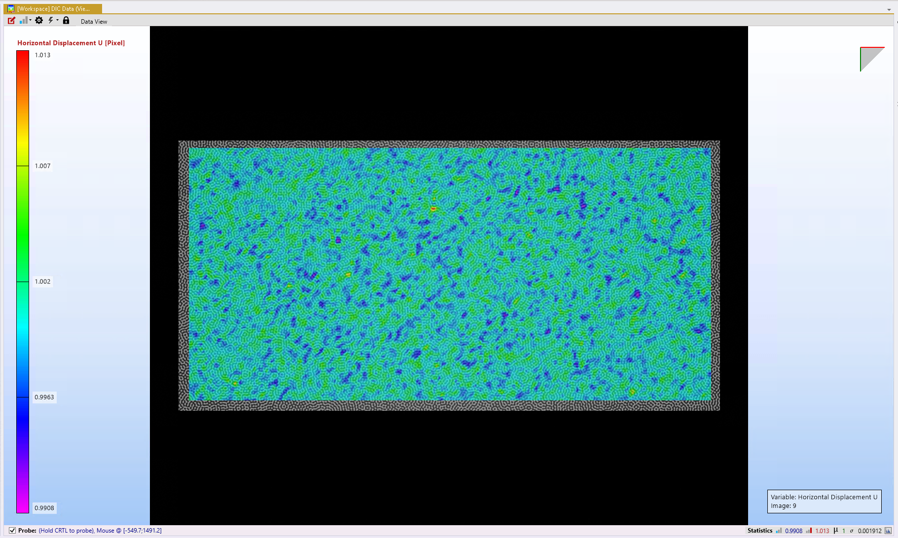

# 2D DIC using Blender

## What is Blender and how is it used
Blender is an open source computer graphics software.  
It can be used to render images through both rasterisation and ray-tracing.  
Blender can be automated using the blender-python API `bpy`.  

## How is the mesh imported
Data from the SimData object can be extracted and imported as a mesh - and subsequently used to deform the object.  
Blender only reads surface meshes, so any 3D meshes must be skinned prior to importing.  
The SimData mesh must be converted to .obj format to be imported into Blender - as it supports both quad and triangle meshes.   

## Defining camera/lighting parameters
The intrinsic lighting and camera parameters can be precisely defined.  
The camera currently being modelled is an AV Alvium 1800 U-507:  
- Pixel dimensions: 2452 x 2056
- Pixel size: 3.45 um

It should be noted that when calculating the Field Of View, Blender uses a slightly simplified pinhole camera model, so the FOV given by Blender is slightly different than expected. However, this difference is accounted for when defining the camera parameters, so the outputted FOV of the coded Blender should be accurate.   

Four types of lighting can be used:  
- Point 
- Sun
- Spot 
- Area

A point source light is currently being used for these sets of rendered images.  

These parameters can be altered to accurately reflect the experimental setup being used.  
 
## Rigid body motion images
A set of images of an object with a speckle pattern applied, undergoing rigid body motion were produced.  
In-plane rigid body motion between 0 and 1 pixel was applied to the object, and it was imaged.  

 
*An example rigid body motion image*

These images were run through MatchID to compare the MatchID calculated displacement with the imposed displacement  

|Imposed displacement | MatchID displacement |
| :-----------------: | :------------------: |
| 0.1                 |  0.0996913           |
| 0.2                 |  0.199632            |
| 0.3                 |  0.299704            |
| 0.4                 |  0.399797            |
| 0.5                 |  0.500007            |
| 0.6                 |  0.600152            |
| 0.7                 |  0.700318            |
| 0.8                 |  0.800362            |
| 0.9                 |  0.90029             |
| 1.0                 |  1.00001             |

This shows that the displacement that MatchID calculates is very close to the 'true' imposed displacement values.  
The average error between the imposed displacement and MatchID calculated displacement is 0.103%, and the deviation of the MatchID displacement from the imposed displacement is lower than the noise-floor, so can be considered just noise.  
The visualisation of the data confirms this, as no displacement fields are seen, only noise (see below).  

  

## Deformation images
The same mesh object was used to test deformation using Blender. A 2D mesh was specifically used so that there would not be any out-of-plane motion and therefore systematic error.  
The displacements calculated from a MOOSE simulation were taken from the SimData object and applied to the part at subsequent timesteps. 

The ray tracing render engine Cycles was used to render the images.  

 **Change image**
*An example deformed image*  

These images were run through MatchID to compare the calculated displacements to those imposed on the part.  
The initial image was also run through the `pyvale` image deformation capability, to make the comparison more accurate to the use of Blender as opposed MatchID's introduction of error.  
These two data sets were then compared on MatchID.  

 **Change image**
*An example image deformation image*  

# TODO: Add in MatchID images 

#### Comparison of displacements
Both sets of data (from Blender and image deformation) were read into MatchID, and a comparison between the data was taken

The variable that was compared between the two was horizontal displacement, as it was imposed directly onto the mesh in Blender.  
The speckle pattern used on the images is the optimised speckle pattern, is it has a well-distributed histogram.  

A gaussian blur was also applied to the images rendered by Blender, as without it the images' histograms' main features were spikes at 0 and 255 grey-levels.  
- Static images were rendered to establish the impact of applying this gaussian blur on the DIC algorithm and the noise floor.  
-  

It can be seen that the error between the image deformation and Blender images decreases as the displacement increases. Therefore, it would be worthwhile doing the same analysis on sets of images with much larger displacements.   
The difference between displacements in the Blender and image deformation images were also related to the noise-floor, to see whether these differences lay within two standard deviations of the data.   
- This metric differed across the whole data set, as can be seen **below**
- The largest deviation lay within two standard deviations of the mean (**value**)  

 **At different timesteps??**

# TODO: Get example image of error map 

