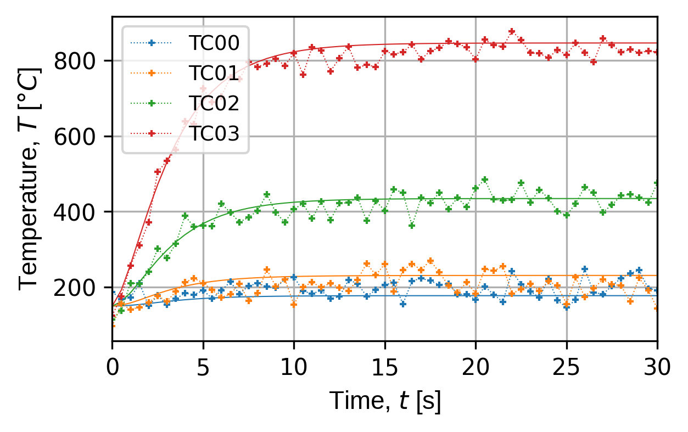

# Digital-Physical Interface Tools: `pyvale` a Digital Validation Engine

Lloyd Fletcher, Adel Tayeb, Michael Atkinson, Alex Marsh.<br>

Applied Materials Technology Group, Fusion Technology Division,<br>
United Kingdom Atomic Energy Authority (UKAEA).

NOTE: due to a conflict on the pypi repository `pycave` has been renamed to `pyvale` as of May 2024s

## Introduction for Financial Year 2023-2024

### Motivation & Impact

Qualification of fusion technology is reliant on simulations to predict the performance of components in extreme (e.g., thermal and electromagnetic) and untestable (e.g., fusion neutron fluxes) environments. Enabling the use of simulations for design qualification requires that they are validated with experimental data over testable domains to reduce uncertainty when extrapolating into irradiated conditions. A key set of tools for simulation validation are the statistical metrics used to assess the agreement between the model and experimental data. High agreement between a model and experimental data increases the credibility of the model and confidence in decisions made based on model predictions.

Validation metrics must account for uncertainties (systematic and random) in the simulation as well as the experimental data. The Advanced Engineering Simulation (AES) Group in the Computing Division at UKAEA are developing the tools necessary to produce probabilistic simulation predictions accounting for uncertainties in model inputs such as geometry, material properties and boundary conditions/loads. The purpose of this project is to develop a software engine to simulate experimental data from a given model and use this to assess the impact of uncertainty in the experimental domain.

A software engine for simulating experimental data from simulations has a wide variety of applications: 1) experiment design and sensor placement optimisation; 2) provide ground-truth data for benchmarking and developing validation metrics; and 3) testing the predictive capability of digital shadows/twins.  A digital shadow is connected to a real-world system and receives sensor data from the system to update the model state. A digital twin takes this one step further by acting on the model state and feeding back control signals into the real-world system. Both of these can be tested by connecting them to another simulation as a surrogate for the real-world system with a layer of software between that acts to simulate the sensor signals. It is then possible to perturb the surrogate real world system to model failure and then assess the predictive capability of the digital twin/shadow.

### Aims & Objectives

The aim of this project is to develop a software engine that can use an input multi-physics simulation to produce a set of simulated experimental data with realistic uncertainties. This software engine will be developed as a python package, as use of python provides access to a range of scientific computing, optimisation and machine learning libraries. The package will be called the python computer aided validation engine (`pyvale`). The underlying engineering simulation tool is assumed to be the Multi-Physics Object Oriented Simulation Environment (MOOSE) being developed for fusion digital twin applications by the AES group. The objectives of this project are to create:

1. An overarching conceptual model of a sensor to be implemented as an abstract base class.
2. A module that contains a library of different sensors:
    * Including different spatial arrangements (e.g. point, line, camera/area, volume).
    * Including increasing complexity of quantities of interest: scalar, vector & tensor.
    * A sensor array module that can manage a variety of sensors selected from the library.
3. An experiment simulation module that can take an input multi-physics simulation (from MOOSE) and a sensor array using the above module to generate a simulated experimental dataset.
4. A validation dataset factory module that can perturb an input multi-physics simulation (e.g., geometry, material model, boundary conditions) and apply a sensor array to create a series of ‘invalid’ datasets to assess validation metrics.

### Deliverables for Financial Year 2023-2024

The scope of the following deliverables were set based on the project starting half way through the year with an equivalent allocation of 0.75 FTE. All deliverables have been achieved and the results are detailed in this report.

1. A report detailing a development work plan for the package as well as full system specifications.
    * Detailed in the following document.
2. A flow chart for the package showing the key classes/functions and their relationships as well as external dependencies.
    * See the [flow chart](#package-workflow--flow-chart-pyvale) below.
3. A first version of `mooseherder`, a package being developed to be able to run MOOSE simulations in parallel, which is required for objective 4 and 5 as well as other projects within AMT on test design and topology optimisation.
    * Source code for `mooseherder` v0.1: https://github.com/Applied-Materials-Technology/mooseherder
4. A first version of pyvale demonstrated on the simplest test case of a scalar field with point sensors - specifically, simulated thermocouple data for a divertor monoblock simulation in MOOSE.
    * Source code for `pyvale` prototype: https://github.com/Applied-Materials-Technology/pyvale
    * A prototype demonstration is detailed in this report.

## Package Workflow & Flow Chart: `pyvale`

The overall structure of the `pyvale` package is shown in the figure below. The user inputs to the package include an output exodus file from the MOOSE simulation to be analysed; a list of sensor positions as a `numpy` array where each row is a sensor with position [x,y,z] in the simulation coordinates; and the optional parameter of the sample times as a `numpy` array at which sensor measurements should be simulated. If the user specifies sample times then the sensor values are linearly interpolated between the simulation time steps. Note that if the sample times are not specified they are assumed to coincide with the simulation time steps and no temporal interpolation is performed.

The package has two main classes, the first is a `Field` which interpolates the underlying simulation results to extract the ground truth values for the sensors at the specified times and locations. The second is a `SensorArray` which is an abstract base class (ABC) containing four key methods for simulating sensor output. The `ThermocoupleArray` is a concrete implementation of the `SensorArray` ABC that allows the user to extract measurements with simulated experimental errors.

It should be noted that the `mooseherder` package has a range of additional functionality which is not shown in the figure below as only the current dependencies for the `pyvale` package are shown. This includes the ability to: 1) Dynamically update parameters in a MOOSE or Gmsh input file; 2) Run MOOSE simulations from python with Gmsh mesh generation; 3) Run a parameter sweep of a chain of MOOSE/Gmsh simulations in parallel; and 4) Read the output of the parameter sweep in parallel. This additional functionality of `mooseherder` is demonstrated in the worked examples in the `mooseherder` github repository.

||
|:--:|
|*Overview of the current structure of `pyvale` as applied to the modelling of thermocouples measuring a temperature field.*|

## Prototype Demonstration: `pyvale`

This prototype demonstration will focus on the simplest case for sensor simulation which is point sensors used to measure a scalar field. For this purpose a temperature field measurement with thermocouples was chosen. In the future it is intended that `pyvale` will be extended to simulate more complex sensors such as cameras and more complex fields such as vector (e.g. displacement) or tensor fields (e.g. strain).

Two MOOSE thermal simulations were constructed and run to demonstrate the functionality of the `pyvale`. The input files for these simulations and associated output can be found in the `pyvale` repository [here](https://github.com/Applied-Materials-Technology/pyvale/tree/main/scripts/moose_thermal). The first simulation is based on a MOOSE tutorial problem analysing the thermal field in a 2D plate. For this case the temperature is held constant on the left hand edge and then increased on the right hand edge with a user specified function. The second simulation is a 3D thermal model of a divertor monoblock armour component that includes three materials with temperature dependent material properties (tungsten, copper, copper-chromium-zirconium).

Here we use the code from the [first example](https://github.com/Applied-Materials-Technology/pyvale/blob/main/examples/ex1_2d_thermcouples.py) in the repository to demonstrate the use of `pyvale`. The first step is to import dependencies and use `mooseherder` to read the output exodus file for the simulation of interest:

```python
from pathlib import Path
import matplotlib.pyplot as plt
import mooseherder as mh
import pyvale

data_path = Path('data/plate_2d_thermal_out.e')
data_reader = mh.ExodusReader(data_path)
sim_data = data_reader.read_all_sim_data()
```

Now we need to construct the first input for `pyvale` which is a `Field` object that will be used to interpolate the simulation data to the desired sensor positions.

```python
spat_dims = 2
field_name = 'temperature'
t_field = pyvale.Field(sim_data,field_name,spat_dims)
```

The second required input is the locations of the sensors. Here we use a helper function from `pyvale` to generate a uniform grid of sensor positions excluding edges. The sensor positions can also be manually specified where each row of the `numpy` array is a sensor with position [x,y,z] in simulation coordinates.

```python
n_sens = (3,2,1)
x_lims = (0.0,2.0)
y_lims = (0.0,1.0)
z_lims = (0.0,0.0)
sens_pos = pyvale.create_sensor_pos_array(n_sens,x_lims,y_lims,z_lims)
```

Having created a `Field` object and the desired sensor positions, a `ThermocoupleArray` can now be created. We also generate the standard uncertainty functions by specifying their parameters. The standard systematic error function is a randomly generated constant offset from a uniform distribution where the high and low bounds are specified. The standard random error function is sampled from normal distribution at each sample time where the standard deviation is specified. For this case the maximum temperature is on the order of 100 degrees centigrade so errors on the order of 10's of degrees will be visible on the sensor traces for demonstration purposes.

```python
tc_array = pyvale.ThermocoupleArray(sens_pos,t_field)

tc_array.set_uniform_systematic_err_func(low=-10.0,high=10.0)
tc_array.set_normal_random_err_func(std_dev=5.0)
```

Custom functions for generating the systematic and random errors can be specified using the methods of `ThermocoupleArray`, `set_custom_systematic_err_func()` and `set_custom_random_err_func()`. For this case the functions must take a single `size` parameter which will be the size of the measurement `numpy` array. The measurement array has dimensions of [number of sensors, number of sample times]. The custom error function must return a `numpy` array of this size. Note that the in-built python `functools` package can be useful for creating user specified error functions and additional examples of this will be included in future versions.

The measurements are constructed using: measurement = truth + systematic error + random error. The measurements are returned as a `numpy` array with dimensions of [number of sensors, number of sample times]. Simulated measurements from the `ThermocoupleArray` can then be generated using:

```python
measurements = tc_array.get_measurements()
```

The location of the sensors can be interactively viewed in 3D on the simulation mesh using `pyvista`. The figure below shows the simple 2D plate with the locations of the simulated thermocouple grid.

```python
pv_sens = tc_array.get_visualiser()
pv_sim = t_field.get_visualiser()
pv_plot = pyvale.plot_sensors(pv_sim,pv_sens,field_name)
pv_plot.add_scalar_bar('Temperature, T [degC]')
pv_plot.show()
```

||
|:--:|
|*Simple 2D thermal plate visualised with pyvista showing thermocouple location over the simulated temperature field for the last time step.*|

The time traces for the simulated thermocouples can also be plotted for the total simulation duration using the `plot_time_traces()` function with an example time trace plot shown below. Note that the solid lines on the plot correspond to the truth and the dashed lines with crosses are the simulated sensor values.

```python3
(fig,ax) = tc_array.plot_time_traces(plot_truth=True)
plt.show()
```

||
|:--:|
|*Simulated thermocouple traces for the 2D plate model with sensor locations shown in the previous figure. The simulated traces use dashed lines with crosses abd include systematic and random error models. The solid lines are the ground truth taken from the simulation.* |

The same functionality is demonstrated for the 3D simulation of a monoblock divertor armour in the [second example](https://github.com/Applied-Materials-Technology/pyvale/blob/main/examples/ex2_3d_thermcouples_monoblock.py) in the `pyvale` repository. The 3D visualisation and thermocouple traces for the monoblock model are shown below.

||
|:--:|
|*Monoblock 3D thermal model visualised with pyvista showing thermocouple location over the simulated temperature field for the last time step.*|


||
|:--:|
|*Simulated thermocouple traces for the 3D monoblock model with sensor locations shown in the previous figure. The simulated traces use dashed lines with crosses and include the systematic and random error models. The solid lines are the ground truth taken from the simulation.* |


# System & Software Specification: `pyvale`

The purpose of this section is to provide a system specification for the complete `pyvale` software with all proposed functionality. This articulates the overarching vision for the `pyvale` software and provides a roadmap for further developement.

## Aims & Objectives of `pyvale`

The aim of `pyvale` is to develop an engine to simulate validation experiments and sensors applied to a multi-physics simulation that recreate realistic uncertainties. The use of `pyvale` is meant to follow from the digital engineering design workflow starting at CAD for geometrical design to CAE for multi-physics simulation and then Computer Aided Validation (CAV). CAV allows an engineer to design and dynamically optimise a series of validation experiments. The overall purpose being to minimise the experimental cost and time required to validate a simulation by extracting as much high-quality validation data as possible per experiment. The objectives of `pyvale` are to provide workflows that allow engineers to perform:

1. Uncertainty visualisation & quantification for any given array of sensors applied to a multi-physics experiment and simulation.
2. Simulation validation analysis through calculation of validation metrics accounting for realistic experimental uncertainties.
3. Sensor selection and placement optimisation for a given set of experimental scenarios with the ability to deal with multi-physics experiments.
4. Simulation-driven experimental design allowing engineers to use active learning approaches to iteratively update experimental parameters to extract the most information per experiment.

### Extension Aim

An extension aim of `pyvale` will be to provide real-time sensor emulation software that can be used to validate the performance of digital shadows/twins without having to connect them to a real world system. Here the idea will be to use two simulations, one of which is the digital shadow/twin and one which is a surrogate for the real world system. The `pyvale` sensor emulation engine will then be used to sample the surrogate system and provide simulated sensor signals to the digital shadow/twin. The surrogate system can then be perturbed with different expected states, including failure scenarios, with the associated sensor signals fed through to the digital shadow/twin. The predictions of the digital shadow/twin can then be assessed against the known 'truth' state taken from the surrogate simulation. This provides significant advantages for testing digital shadows/twins as the underlying state of the surrogate physical system is known which is not the case for a real physical system.

### Workflows & Implementation

A simplified workflow using the whole functionality of `pyvale` would be as follows:

1. Input a series of multi-physics simulations for the experimental scenarios of interest.
2. Optimise the experimental parameters and selection/placement of sensors used for the experiments to extract the most high-quality validation data while minimising costs.
3. Perform the experiments and input the data to calculate validation metrics that use uncertainty quantification to assess the degree to which the simulation agrees with the experimental data.
4. If the model is deemed valid it can be used for design qualification decisions. If the model is not valid, use active learning to determine areas of highest uncertainty and repeat the process to design a new series of experiments.

This workflow contrasts with current validation experimental procedures, which perform parameter sweeps or grid searches that gather a large amount of redundant data. The `pyvale` engine will provide iterative optimisation procedures to minimise experimental effort and cost while providing more high-quality validation information to reduce design risk.

The `pyvale` engine will be modular, allowing users to design custom workflows to answer engineering questions of interest by performing 'What if?' analysis. For example:

- Given a specific set of sensors that are already deployed on an engineering system what are the expected uncertainties on these measurements and how do these propagate through to my chosen validation metric?
- How sensitive is a chosen validation metric to differences in the simulation parameters (geometry, material properties and boundary conditions/loads) e.g. if my material properties change by 10% does my validation metric and chosen sensor array detect this difference?
- If the data from my experimental campaign determines that my simulation is not valid what is the likely cause of this difference (geometry, material properties and/or boundary conditions/loads)?

The `pyvale` engine will leverage machine learning algorithms to solve regression, classification, uncertainty quantification and multi-objective optimisation problems throughout the workflow. Regression models will be used to predict physics field variables from sparse sensor values; classification models will be used to validate simulations; uncertainty quantification will be used in the digital and physical spaces as part of validation metric calculations; and multi-objective optimisation will be used for simulation-driven experimental design and sensor selection/placement optimisation.


## Deliverables for Financial Year 24-25

The scope of the deliverables for this project will be adjusted to take advantage of any synergies with other research projects throughout UKAEA such as digital shadow/twin work in the Advanced Engineering Simulation group or as part of EPSRC Key Challenge 4 on digital qualification. An initial proposal for core deliverables in the next financial year is given below.

**Core Deliverables:**

1. Enhanced uncertainty function generation for random errors, with a focus on point sensors, including:
    - Specification of noise as a function/percentage of sensor measurement value
2. Enhanced uncertainty function generation for systematic errors, with a focus on point sensors, including:
    - Calibration errors
    - Digitisation errors
    - Positioning errors
    - Spatial averaging errors
    - Temporal averaging errors
    - Ability to collapse all of the above into a single probability density function
3. Developement of library sensor models to include:
    - Measurement of a vector field accounting for sensor orientation
    - Developement of simplified camera sensor models for:
        - Infrared cameras measuring temperature fields
        - Digital image correlation measuring displacement field on a surface
4. A toolbox for calculating validation metrics from sensor data (simulated or real).
5. Software tests using `pytest` for point sensor functionality after completion of the additional features.
6. Automated documentation generation and worked examples using the following test cases:
    - Thermo-mechanical analysis of a simple 2D plate
    - Thermo-mechanical analysis of a 3D divertor monoblock model

**Extension Deliverables:**
- An application of `pyvale` to optimise placement of neutronics sensors for LIBRTI. Set as extension as dependent on provision of a relevant neutronics simulation.
- A toolbox for simulation parameter calibration using optimisers from the multi-objective optimisation library `pymoo`.
- A journal article in SoftwareX detailing the implementation of the first version of `pyvale`.
- A journal article detailing the application of `pyvale` to the simulations and experimental data generated as part of the EPSRC Key Challenge 4 'simple test case'.


